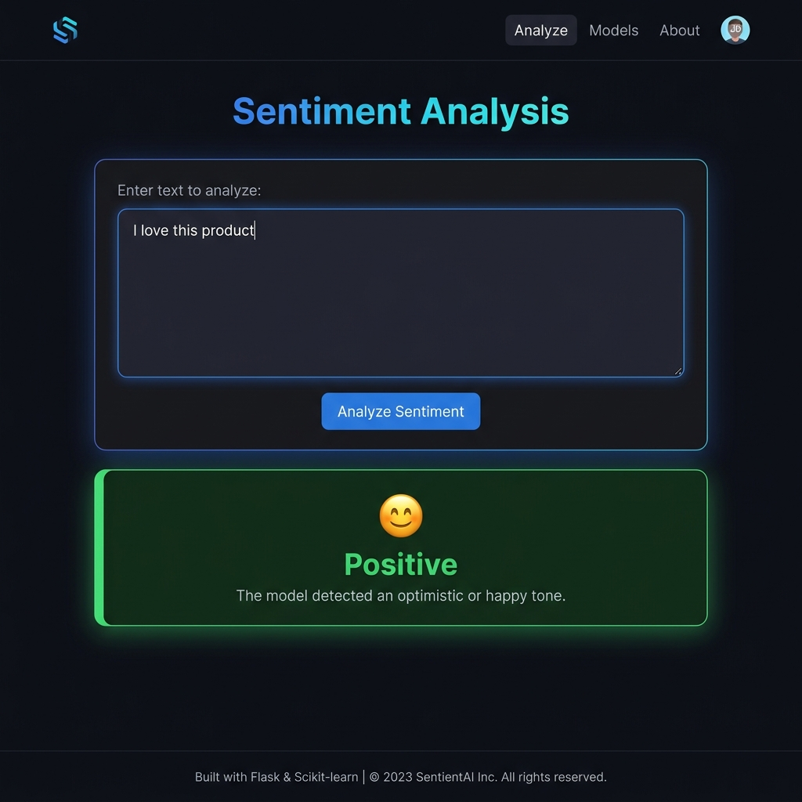

# 💬 Sentiment Analysis Web App (ML + Flask)

A Machine Learning-based web application that predicts the sentiment of text (Positive 😊 or Negative 😡) using Natural Language Processing (NLP), built with Flask.

---

## 🚀 Features

- 🔮 Real-time sentiment prediction.
- 🧠 Logistic Regression model with TF-IDF vectorization.
- 🧹 Advanced text preprocessing (URLs, mentions, stopwords, negation-aware).
- 🌐 Flask-based web application.
- 🎨 Responsive dark-mode UI.
- ✨ Animated result display.
- 🔄 Clear button to reset input and result.

---

## 🛠 Tech Stack

| Layer | Technology |
|-------|-----------|
| Language | Python 3 |
| ML Model | Logistic Regression |
| Vectorizer | TF-IDF (bigrams) |
| NLP | NLTK, scikit-learn |
| Data | Pandas, NumPy |
| Web Framework | Flask |
| Frontend | HTML, CSS |

---

## 📊 How It Works

1. Load Twitter dataset (`twitter.csv`)
2. Clean text (remove URLs, mentions, special characters, stopwords)
3. Convert text into numerical features using **TF-IDF Vectorizer** (unigrams + bigrams)
4. Train **Logistic Regression** classifier with balanced class weights
5. Save model using pickle
6. Build Flask app for user input
7. Predict sentiment and display result

---

## 📁 Project Structure

```
Sentiment-Analysis-Flask-ML/
│── app.py
│── train.py
│── twitter.csv
│── model.pkl
│── vectorizer.pkl
│── requirements.txt
│── README.md
└── templates/
    └── index.html
```

---

## ⚙️ Installation & Setup

### 1. Clone Repository
```bash
git clone https://github.com/umasuryateja/Sentiment-Analysis-Flask-ML.git
cd Sentiment-Analysis-Flask-ML
```

### 2. Install Dependencies
```bash
pip install -r requirements.txt
```

### 3. Train Model
```bash
python train.py
```

### 4. Run App
```bash
python app.py
```

### 5. Open Browser
```
http://127.0.0.1:5000/
```

---

## 🧪 Sample Inputs

| Input Text | Output |
| --------------------------------- | ----------- |
| I love this product | Positive 😊 |
| This is terrible service | Negative 😡 |
| I hate everything about this | Negative 😡 |
| This is absolutely amazing! | Positive 😊 |

---

## 📸 Screenshots

**Positive Result**


**Negative Result**


---

## 🎯 Key Learnings


- Feature extraction using TF-IDF Vectorizer
- Model training using Logistic Regression
- Handling class imbalance with balanced class weights
- Integrating ML model with Flask
- Building interactive web applications

---

## 🚀 Future Improvements

- 📊 Add confidence score display
- 🌳 Use advanced models (Random Forest, LSTM, BERT)
- 📍 Improve handling of sarcasm
- 🌐 Deploy online (Render / Railway)

---

## 🔗 GitHub

[https://github.com/umasuryateja/Sentiment-Analysis-Flask-ML](https://github.com/umasuryateja/Sentiment-Analysis-Flask-ML)

---

⭐ If you like this project, give it a star!
